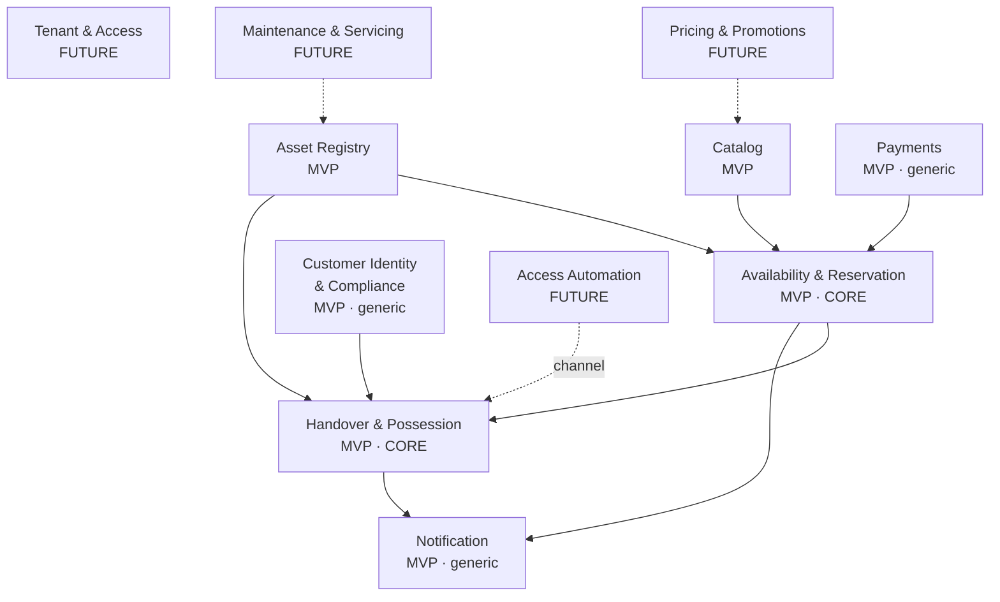

# Architecture Foundation Specification
## Part 1 — Domain & Boundaries

| | |
|---|---|
| **Status** | Draft — authoritative for terminology |
| **Scope** | Sections 1–6 only. Users, workflows, requirements, technology selection and ADRs are deliberately out of scope and belong to later parts. |
| **Audience** | Senior engineers, and AI coding agents treating this document as the source of truth for naming and boundaries. |

### How to read this document

Every element of the domain and every bounded context is tagged **[MVP]** (required for the pilot customer to operate at all) or **[Future]** (required only when onboarding other rental companies or unlocking advanced capability). The tags are not aspirational roadmap markers — they are a build instruction. Anything tagged `[Future]` must not appear in code, tables, configuration or naming during the pilot unless this document explicitly says its *identifier* must exist from day one.

Decisions are numbered `D-01`…`D-13` and assumptions `A-01`…`A-07`. Both are greppable. Where a later part of this specification contradicts a decision here, that later part must reference the decision number and supersede it explicitly.

---

## 1. Product Vision

The product is a **rental operations platform**, not a shop with a checkout attached. This distinction is the foundation of everything below, so it is worth being blunt about it: e-commerce systems model the *transfer of ownership*, which is an event. This system must model the *transfer of possession*, which is a period — one that begins, persists, is at risk for its entire duration, and must be closed out. The asset is expected back. It is expected back in a particular condition. Somebody is accountable for it in the interval. Almost every non-obvious requirement in this domain descends from that single structural fact, and any design that treats a rental as "an order with a return date" will be fighting reality within a month of launch.

The authoritative question the system exists to answer is: **which physical asset is in whose hands right now, in what condition, and under what agreement?** Everything else — the catalog, the payment, the reservation — is a supporting apparatus around that question.

The agreement is not implied by payment. Before payment, the Customer must be shown rental terms, deposit and deduction rules, and required pre-contractual information; acceptance is recorded on the ReservationGroup with timestamp and terms version. Without this, condition evidence proves facts but not authorisation.

For the pilot customer, a two-person tool rental business in Slovakia with roughly 200 assets, the platform's job is narrow and concrete. Move the reservation and the rental payment online so that the owner stops negotiating availability over the phone. Make the physical handover fast enough that one employee can run it from a phone with a QR scan. Produce a defensible record of condition at both ends of the rental, because the deposit exists precisely because condition disputes exist. That is the whole pilot. It is not a large product, and it should not be built like one.

The strategic ambition is different in kind, not just in size. The intent is that a camera rental house, a trailer yard or an event equipment company could later run on the same platform. This is a credible ambition because the domain generalises unusually well: the reservation-handover-possession-return-settlement loop is close to identical across all of them, and the differences (what an asset *is*, how it is priced, whether it is delivered) live at the edges rather than in the core. The bet is that the loop is the product and the vertical is configuration.

**Non-goals for the pilot**, stated so they can be pointed at later: this platform is not an accounting system, not a CRM, not a maintenance management system, not a marketplace, and not a delivery logistics system. It has no interest in B2B customers, invoicing complexity, multi-location inventory, or dynamic pricing. Each of these is a real business eventually. None of them is a real business at 200 assets and two people.

### The central tension, and how it is resolved

The brief names the tension precisely: ship tiny and cheap now, without foreclosing a multi-company future. The resolution running through this document is a single principle — **pay for optionality only where it is nearly free today, and refuse it everywhere else.** By that test exactly two bets are worth making now: tenant identity in the model, and generality in the asset abstraction. Both cost close to nothing if made today and are punishingly expensive to retrofit. Everything else on the "future" list — IoT, RFID, smart lockers, delivery, analytics, pricing engines — is refused outright, on the grounds that speculative structure built for a customer who does not exist is the most reliable way to never reach that customer.

> **D-01 — Tenancy model**
> **Considered:** (a) true multi-tenant SaaS, one codebase and one data plane serving many companies; (b) white-label, a separate deployment per company; (c) leave both open.
> **Trade-offs:** (b) has genuinely lower initial modelling cost and gives customers hard isolation, but its operational cost scales linearly with customers — *n* deployments means *n* migrations, *n* incident surfaces, *n* configuration drifts — and that cost is paid by one solo developer. (c) is not actually a third option: optionality has a carrying cost and it decays, and a solo developer under time pressure will inevitably resolve every ambiguity toward the single-tenant assumption already in front of them. "Leaving it open" reliably produces (b) by accident, minus the isolation benefits.
> **Recommended:** **(a), with a strict qualification — a multi-tenant *model*, single-tenant *operations*.** Every aggregate root carries a Tenant identity from the first line of code. There is exactly one Tenant row during the pilot, no tenant onboarding, no tenant administration, no per-tenant configuration machinery, no plan or subscription concept. Tenancy is a modelling invariant, not a product feature.
> **Why:** the cost of multi-tenancy is paid almost entirely at model-definition time and is small if paid now, whereas retrofitting a tenant boundary later means rewriting every query and every authorisation rule against data already live in production. The asymmetry is decisive: a multi-tenant model can always be deployed single-tenant for a customer who demands isolation, but a single-tenant model cannot be made multi-tenant without a rewrite.

---

## 2. Core Architectural Principles

**P1 — The physical world is the source of truth; the system is a ledger of claims about it.** The database will be wrong. An employee will hand over the wrong drill, forget to scan, or scan twice. Every asset state transition must therefore be correctable by a human through the product itself, with a reason recorded, without a database console. Design for reconciliation, not for the fiction that the record cannot diverge from the warehouse.

**P2 — Tenancy is a modelling invariant, not a feature.** Every aggregate root is owned by exactly one Tenant. No aggregate ever references an aggregate belonging to another Tenant. This holds from day one, when there is exactly one Tenant and no way to create a second. See D-01.

**P3 — The scan is the primary interaction of the physical side.** QR scans drive the operational loop. The design consequence is that a scan must resolve to exactly one meaningful domain event given the asset's current state — the operator scans, and the domain decides what that means. If a context requires the operator to first tell the system *what they are about to do* and then scan, the model has been drawn in the wrong place.

**P4 — Possession is derived from history, not stored as an opinion.** The sequence of handover events for an asset *is* the asset's story, and it is the artefact you will need when a customer disputes a deposit deduction. Possession and condition therefore live in an append-only event history. This is not a mandate for event sourcing across the system — everything else uses ordinary mutable state, and pretending otherwise would be exactly the over-engineering this document is trying to avoid. See D-10.

**P5 — Boundaries are conceptual before they are physical.** The bounded contexts in Section 4 are modules, not services. They are enforced by naming discipline and dependency direction, not by network calls. Distribution is a late optimisation that buys nothing at this scale and costs a solo developer everything. See D-02.

**P6 — Money the platform does not move is not a Payment.** The pilot takes deposits in cash, off-platform. The system must record that this happened without pretending it processed it. Conflating an obligation the operator settles by hand with a transaction the platform executes against a payment provider produces a Payments context that lies about its own responsibilities. See D-07.

**P7 — Personal data is a liability with a clock on it.** Every piece of personal data is created with a retention deadline attached, and deletion is a routine, cheap, scheduled, boring operation rather than an incident response. This principle exists because the product requires customers to upload photographs of their identity documents, which is the highest-severity data this system will ever hold. See D-11.

**P8 — Optionality must be nearly free or it must be abandoned.** Applied ruthlessly. Tenant identity and asset-type generality pass this test. Smart lockers, RFID, IoT telemetry, delivery routing and pricing engines do not, and are refused — with one narrow exception noted in Section 3, where refusing them costs nothing because the boundary that would accommodate them is one we want for other reasons anyway.

> **D-02 — Context distribution**
> **Considered:** (a) services per context; (b) a single deployable with contexts as internal modules; (c) no explicit boundaries at all, structure emerging later.
> **Trade-offs:** (a) buys independent scaling and deployment, and costs distributed transactions, network failure modes and *n* operational surfaces — all paid by one person, for a system serving two employees and a few hundred consumers. (c) is cheapest today and reliably produces a model where every concept touches every other, which is the specific failure that makes multi-tenancy and vertical generality impossible later.
> **Recommended:** **(b).** Contexts are logical modules inside one deployable, with explicit dependency direction and no shared internal state across boundaries.
> **Why:** the boundaries are worth having for modelling clarity and future extraction; the network is not worth having for any reason that applies at this scale. Modules can become services later; a mud ball cannot.

---

## 3. Domain Overview

### The core loop

A customer browses a catalog of *kinds* of things and reserves one for a range of calendar days. At the appointed time they appear at the counter, an operator identifies them, takes a cash deposit, picks a specific physical unit off the shelf, records its condition, scans it, and hands it over. Possession begins. Days later the unit comes back, is scanned in, is inspected, its condition is recorded again, and the deposit is returned in full or in part. Possession ends. The unit rejoins the rentable pool.

Three structural facts in that paragraph govern the entire design.

**First: there are two clocks, and they diverge constantly.** The *commercial* clock is what was booked and paid for — a reservation for 5–7 March. The *physical* clock is what actually happened — the customer arrived late on the 5th and brought the drill back on the 9th, or not at all. Naïve rental systems store one clock and then find themselves unable to represent an overdue return without corrupting the booking. These must be separate lifecycles that reference each other, and neither may own the other. This fact alone justifies the boundary between Reservation and Possession, and it is the single most important sentence in this document.

**Second: an Asset is not an AssetType.** The customer wants *a* rotary hammer; the business hands over *rotary hammer #17*. The gap between what was promised (a kind) and what was delivered (an instance) is where availability, substitution and overbooking all live. Reservations bind to AssetTypes. Possession binds to Assets. Collapsing the two — reserving a specific serial number at booking time — is the most common early mistake in this domain, and it manufactures rigid reshuffling logic in exchange for a guarantee no consumer renting a drill has ever asked for.

**Third: condition is adversarial, and evidence is the domain's answer.** The deposit exists because assets come back broken and people disagree about who broke them. Condition capture is therefore not a nice-to-have audit trail; it is the mechanism by which a deposit deduction becomes defensible rather than a shouting match at a counter. Evidence at *both* ends of the rental is non-negotiable, because the outbound report is what protects the customer and the inbound report is what protects the operator, and a deduction supported by only one of them is worthless.

### Subdomain classification

**Core** — Availability & Reservation, and Handover & Possession. This is where the business is actually won or lost and where design effort belongs. Everything below deserves the minimum viable amount of thought.

**Supporting** — Catalog, Asset Registry, Condition & Settlement. Specific to this business but not differentiating; get them correct and boring.

**Generic** — Payments, Customer Identity, Notification. Buy, wrap, and touch as little as possible.

### [MVP] — required for the pilot to operate

Asset Registry (asset identity, QR binding, rentable status). Catalog (asset types, day rate, deposit amount, publication). Availability & Reservation (day-granularity calendar, booking). Customer Identity & Compliance (ID evidence, verification, retention clock). Payments (the online rental fee only). Handover & Possession (agreement, handover in/out, deposit obligation, condition, settlement). Notification (deliberately dumb: confirmations and return reminders).

That is the entire pilot. Roughly 200 assets, two staff, one location, consumer customers, one country.

### [Future] — deferred, and not to be built now

**Tenant Management** — tenant onboarding, staff accounts, roles, per-tenant configuration. Note carefully: the *Tenant identifier* exists in every aggregate from day one per D-01; the *management surface* does not exist at all.

**Pricing & Promotions** — anything beyond a flat per-day rate: weekend rates, tiered durations, discounts, deposit waivers for repeat customers.

**Maintenance & Servicing** — service intervals, repair records, parts. The owner currently does this in his head and at 200 assets that is genuinely fine. It becomes real at the first tenant with construction machinery and statutory inspections.

**Utilisation & Reporting** — which assets earn, which gather dust.

**Logistics & Delivery** — delivery, collection, multiple depots.

**Billing & Subscription** — charging tenants for the platform. This is the SaaS business itself and it does not exist until the second tenant does.

**Access Automation** — smart lockers, RFID gates, IoT telemetry, unattended pickup. This one deserves a note, because it is the case where refusing optionality would be a mistake. A smart locker is not a new domain: it is a **different channel for the same Handover event**. If Handover is modelled as a channel-agnostic domain event — something happened, an asset changed hands, an operator or a machine attested to it — then locker support later costs a new channel implementation and nothing structural. That boundary is one we want anyway for testability and correctness, so taking it costs nothing today. This is the whole of P8 in one example: the future is accommodated by drawing an honest boundary now, not by building anything.

---

## 4. Proposed Bounded Contexts

### Context map

Arrows point from upstream to downstream: the downstream context depends on the upstream one's language. There are no cycles, and no context reaches into another's internals.

### [MVP] Asset Registry

Owns the **Asset** — the individual physical unit, its identity, the AssetTag bound to it, and its lifecycle status (Rentable, InPossession, UnderInspection, Unavailable, Retired). It answers "what do we physically own and can it be rented at all". It does **not** own price, does **not** own the availability calendar, and does **not** know what a Reservation is. Upstream of Availability & Reservation and of Handover & Possession.

**Asset acquisition is not modelled in the MVP.** An Asset comes into existence because an Operator registers it through the product; there is no purchase workflow, no supplier, no intake or goods-received concept, no acquisition cost and no depreciation. An Asset's history in this system begins at registration, not at purchase.

Note the deliberate absence of a `Reserved` status. Availability is a property of a *calendar*, not of an asset — an asset is not "reserved", a *day* is spoken for. Putting a Reserved flag on an asset is how systems in this domain acquire their first unfixable bug.

### [MVP] Catalog

Owns the **AssetType** — the bookable kind, its description, its per-day rate, its deposit amount, and whether it is published. It does **not** own instances and does **not** know how many exist.

> **D-03 — Catalog separate from Asset Registry**
> **Considered:** (a) one context owning both kinds and instances; (b) two contexts.
> **Trade-offs:** (a) is one fewer concept and is genuinely simpler for a week. (b) costs one extra boundary.
> **Recommended:** **(b).**
> **Why:** "what customers may book" and "what we physically own" have different rates of change, different readers, different lifecycles, and — critically — the AssetType/Asset gap is the central fact of the domain (Section 3). A boundary that makes the domain's most important distinction structurally impossible to blur is worth one extra concept.

### [MVP · CORE] Availability & Reservation

Owns the **Reservation**, the **ReservationGroup** (D-13) and the day-granularity availability calendar. Holds the domain's hardest invariant: for any AssetType and any calendar day, the number of active Reservations must not exceed the number of Assets of that type that are Rentable. It does **not** own money, does **not** own assets, and knows nothing about what happens at the counter.

> **D-04 — Reservations bind to AssetType, not Asset**
> **Considered:** (a) assign a specific Asset at reservation time; (b) reserve a type only, assign the instance at handover; (c) hybrid, configurable per type.
> **Trade-offs:** (a) lets you promise a specific unit and forces you to write reassignment logic for every breakage, every early return, every damaged unit — reshuffling a calendar that nobody asked to be precise. (b) gives operational slack for free: the employee grabs whichever unit is on the shelf. The cost of (b) is that you cannot promise a specific serial number, which matters for nobody renting a drill and may matter later for, say, a specific camera body.
> **Recommended:** **(b) for MVP**, with the model refraining from *assuming* deferred assignment is universal, so that (c) remains reachable as a per-AssetType policy.
> **Why:** with day granularity and one employee, instance choice at the counter is free and absorbs real-world failure gracefully; early binding buys a guarantee this customer segment does not value and charges for it in permanent complexity.

> **D-13 — Grouped reservation (one checkout, several AssetTypes)**
> **Considered:** (a) one Reservation carrying multiple lines, each line binding to an AssetType; (b) *n* parallel single-AssetType Reservations tied together by a grouping concept; (c) *n* parallel single-AssetType Reservations with no grouping at all — the basket is a UI concept that evaporates at checkout.
> **Trade-offs:** (a) is the e-commerce reflex and it breaks on contact with this domain. The moment a customer wants the hammer for 5–7 March and the scaffolding for 5–12 March, the RentalPeriod stops being a property of the Reservation and becomes a property of the line — at which point the lines are the real aggregates and the Reservation is a grouping wearing an aggregate's clothes. It also makes the Reservation's lifecycle compound and therefore dishonest: a customer collects the hammer, the scaffolding turns out to be damaged, and there is no truthful single status to write down. The availability invariant is per-AssetType-per-day, so an aggregate spanning several AssetTypes is larger than any invariant it protects, which is the classic aggregate sizing error. (c) is the tempting minimal answer and it does not actually remove the grouping — it relocates it. One card payment must cover *n* Reservations, so either you charge the card *n* times (bad for the customer and for fees) or the Payment becomes the thing that knows which Reservations belong together. That puts a domain fact inside the one context this document insists must stay generic and thin, and it means cancelling "the order" six weeks later requires the domain to ask Payments a domain question. (b) costs exactly one concept.
> **Recommended:** **(b)**, with the grouping named **ReservationGroup** and owned by Availability & Reservation.
> **Why:** the grouping is a real fact whether or not it is modelled — the Customer made one decision, made one payment, and will show up once — and refusing to name it does not delete it, it just smears it into Payments or into a UI concept that cannot survive a refund. One dull concept is cheaper than either.
>
> **Constraints on ReservationGroup, so that it does not grow into an Order.** It holds the set of Reservations created in one checkout and the single Payment that covers them, and nothing else. It carries **no status of its own** — NoShow, Overdue and cancellation are derived from its Reservations, never written onto the group. It holds no RentalPeriod: each Reservation owns its own. It enforces no availability invariant: each Reservation is checked independently against the calendar. And it never becomes a RentalAgreement — a pickup visit collecting three Assets produces three HandoverOut events and three RentalAgreements, because Possession is per-Asset and always will be. The term **Order** remains banned (Section 5); the ban is what this decision is protecting.

### [MVP] Customer Identity & Compliance

Owns the **Customer**, the **IdentityVerification**, the **IdentityEvidence** (the ID photograph) and the **RetentionDeadline** attached to it. Deliberately isolated behind a boundary that is narrower than it looks necessary.

> **D-06 — Identity as its own context rather than fields on Customer**
> **Considered:** (a) identity fields and the ID photo hanging off a Customer record inside the reservation model; (b) a dedicated context owning identity evidence and its lifecycle.
> **Trade-offs:** (a) is obviously less work. (b) costs a boundary and a translation.
> **Recommended:** **(b).**
> **Why:** this data has a *different legal lifecycle* from everything around it — the ID photograph must be erasable on a schedule while rental and accounting history must be retained — and isolating it now makes both scheduled deletion and any future audit a local operation instead of an archaeological dig through every table in the system. This is the cheapest insurance in the document.

### [MVP · generic] Payments

Owns the online rental fee charge and its refunds, wrapped behind an anti-corruption layer so that the provider's vocabulary never leaks into the domain. It does **not** own the deposit (D-07). Keep it thin, keep it boring, and do not let anything else in the system learn what a payment intent is.

### [MVP · CORE] Handover & Possession

The heart of the system. Owns the **RentalAgreement**, the **HandoverOut** and **HandoverIn** events, the **Possession** period, the assignment of a specific Asset to an Agreement, the **DepositObligation** and its settlement, and the **ConditionReport** at each end. Channel-agnostic by construction (Section 3, Access Automation).

> **D-05 — Condition & Settlement merged into Handover & Possession for MVP**
> **Considered:** (a) a separate Condition & Settlement context; (b) merged, with Condition as a clearly named module inside Handover & Possession.
> **Trade-offs:** (a) is the textbook answer and is right once disputes acquire their own workflow, escalation and timeline. (b) risks a context that grows too large.
> **Recommended:** **(b) for MVP**, split when settlement stops being simultaneous with return.
> **Why:** at the pilot's scale, capturing condition and handing the asset over are *literally the same physical act by the same person in the same thirty seconds*; a boundary between them would be an interface with no traffic on the far side. Split it when the business gives you a reason, not before.

### [MVP · generic] Notification

Outbound messages: reservation confirmation, pickup reminder, return reminder. Deliberately stupid — no preference centre, no template engine, no campaign concept. It earns its place in the MVP only because the return reminder is the single highest-leverage operational lever in a business whose main failure mode is people not bringing things back.

### [Future] Tenant & Access · Pricing & Promotions · Maintenance & Servicing · Utilisation & Reporting · Logistics & Delivery · Billing & Subscription · Access Automation

Not built. See Section 3 for what each contains and why it waits. The only day-one obligation any of them imposes is D-01's tenant identifier.

---

## 5. Ubiquitous Language

These terms are normative. Use them exactly, in code, in conversation and in every later part of this specification.

| Term | Meaning | Owned by |
|---|---|---|
| **Tenant** | A rental company operating on the platform. Exactly one exists during the pilot. Every aggregate root belongs to exactly one Tenant. | Tenant & Access `[Future]` |
| **Operator** | A person acting on behalf of the Tenant — the owner or the handover employee. Never called a "user". | Tenant & Access `[Future]` |
| **Customer** | The consumer who reserves and takes possession. | Customer Identity & Compliance |
| **AssetType** | A bookable *kind* of thing ("rotary hammer, 5kg"). Carries the day rate and the deposit amount. Never an instance. | Catalog |
| **Asset** | One individual physical unit. Never a kind. | Asset Registry |
| **AssetTag** | The QR code physically affixed to an Asset and bound to its identity. The tag is not the asset; tags can be replaced. | Asset Registry |
| **ScanEvent** | An Operator scanned an AssetTag at a time and place. An *intent*, not a transition — the domain resolves its meaning from current state (P3). | Handover & Possession |
| **RentalPeriod** | A closed interval of whole calendar days in the Tenant's local timezone. 5–7 March is three RentalDays and the asset is due back on the 7th. | Availability & Reservation |
| **RentalDay** | The unit of charge and of availability. In the pilot there is no smaller unit (A-04); hourly granularity for some AssetTypes is a planned extension that will generalise this term, not replace it (D-12). | Availability & Reservation |
| **Reservation** | A Customer's commercial claim on **one** AssetType for a RentalPeriod. Binds to a type, never to an Asset (D-04). Never plural: a checkout covering three AssetTypes produces three Reservations (D-13). | Availability & Reservation |
| **ReservationGroup** | The set of Reservations created in a single checkout and the single Payment covering them. Has no status, no RentalPeriod and no invariant of its own (D-13). Never called an Order. | Availability & Reservation |
| **Availability** | Derived, never stored as an asset flag: Rentable Assets of a type, minus active Reservations, per calendar day. | Availability & Reservation |
| **RentalAgreement** | The contract that comes into being at HandoverOut. Binds one Customer, one Asset and one Reservation, and references the terms version accepted pre-payment on the ReservationGroup. | Handover & Possession |
| **HandoverOut** | The event of an Asset leaving the Tenant's control. Opens Possession. | Handover & Possession |
| **HandoverIn** | The event of an Asset returning to the Tenant's control. Closes Possession. | Handover & Possession |
| **Possession** | The period between HandoverOut and HandoverIn. The physical clock (Section 3). | Handover & Possession |
| **DepositObligation** | The amount the Customer owes as security, taken in cash at HandoverOut. An obligation the Operator settles by hand, never a transaction the platform executes (D-07). | Handover & Possession |
| **DepositTaken** / **DepositReturned** | Operator attestations that cash changed hands, with amount and any deduction reason. Attestations can be wrong; they are correctable (P1). | Handover & Possession |
| **ConditionReport** | Recorded observations plus photographic evidence of an Asset's state, captured at each Handover. | Handover & Possession |
| **Settlement** | The closing of a RentalAgreement: condition assessed, deposit returned in full or in part, Asset returned to the pool. | Handover & Possession |
| **IdentityVerification** | The record that an Operator or the system checked a Customer's identity, and the outcome. | Customer Identity & Compliance |
| **IdentityEvidence** | The ID photograph itself. Always carries a RetentionDeadline. | Customer Identity & Compliance |
| **RetentionDeadline** | The date after which a piece of personal data must be gone. Set at creation, never absent (P7). | Customer Identity & Compliance |
| **Overdue** | Possession that has outlived its Reservation's RentalPeriod. | Handover & Possession |
| **NoShow** | A Reservation whose RentalPeriod began without a HandoverOut. | Availability & Reservation |

### Banned and ambiguous terms

Do not use, anywhere: **Booking** (use Reservation) · **Order** (nothing here is an order) · **Item** (ambiguous between Asset and AssetType — this is the ban that matters most) · **Product** (implies ownership transfer) · **Inventory** (implies fungible stock, which Assets are not) · **User** (say Customer or Operator) · **Check-out / Check-in** (irreparably ambiguous between commercial and physical clocks — say HandoverOut / HandoverIn) · **Rental** as a bare noun (say Reservation, RentalAgreement or Possession, and be specific about which clock you mean).

---

## 6. Core Business Concepts

### Asset states and the availability overlay

An Asset is in exactly one of: **Rentable**, **InPossession**, **UnderInspection**, **Unavailable** (damaged, in service), **Retired**. That is the complete list, and the absence of `Reserved` is deliberate and load-bearing: a reservation is a claim on a *type* for a *day*, so it cannot be a state of an instance. Availability is a calendar overlay computed from Rentable assets minus reservations, never a flag written onto a thing.

### The availability invariant

For any AssetType on any calendar day: active Reservations ≤ Rentable Assets of that type.

This is a cross-row aggregate invariant and cannot be guaranteed by simple foreign keys or uniqueness alone; implementation requires an explicit concurrency mechanism (for example per-type-per-day transactional holds, or equivalent serialization).

> **D-08 — Overbooking policy**
> **Considered:** (a) strict — never exceed the Rentable count; (b) allow controlled overbooking with a buffer, as hotels and airlines do.
> **Trade-offs:** (b) raises utilisation and works when failure is recoverable by substitution or compensation. (a) leaves some revenue on the table.
> **Recommended:** **(a), strict.**
> **Why:** overbooking is a bet that some reservations will not materialise, settled by a customer standing physically in front of your one employee expecting the scaffolding they paid for. There is no upgrade to offer them. At 200 assets the utilisation upside is a rounding error against the cost of that conversation.

> **D-09 — Availability of the return day**
> **Considered:** (a) an Asset returned on day X is bookable by someone else on day X; (b) the RentalPeriod's final day is consumed and the Asset rejoins the pool on X+1; (c) a configurable turnaround buffer per AssetType.
> **Trade-offs:** (a) maximises utilisation. (b) sacrifices some utilisation for certainty. (c) is (b) plus machinery nobody has asked for.
> **Recommended:** **(b).**
> **Why:** the asset comes back at an unknown hour and needs inspection before it can go out again; promising it to a second customer on the same day creates a failure mode the system cannot detect until someone is at the counter. This falls out naturally from a one-day minimum with no intra-day turnover (A-04), and (c) remains available later if a tenant's economics justify it.

### Rental granularity

The pilot ships with day granularity only, but hourly rental of some AssetTypes — typically hand power tools — is a plausible extension rather than a fantasy (A-04). The question is therefore whether AssetType should carry a granularity property from day one, unused, on the same reasoning that put a Tenant identity on every aggregate.

> **D-12 — Rental granularity on AssetType**
> **Considered:** (a) give AssetType a `rentalGranularity` property (`day` | `hour`) now, with only `day` ever set during the pilot; (b) do not add the property, and instead spend the same effort on keeping period arithmetic in one place so that the unit can change later; (c) build the interval-based availability calendar now and support both units from launch.
> **Trade-offs:** (c) is exactly the speculative structure P8 refuses and is not seriously considered. (a) costs one enum, which is as close to free as a modelling decision gets — but it is worth being precise about what that enum buys, which is nothing. Hourly rental is not blocked today by the absence of a field; it is blocked by the fact that availability is a set of discrete calendar days, that D-09 consumes the return day rather than computing a turnaround, that a RentalPeriod is a closed interval of days rather than a half-open interval on a timeline, and that day granularity in a single local timezone lets the pilot largely ignore DST while hourly cannot. None of that becomes cheaper because a column exists. (b) costs a discipline rather than a structure.
> **Recommended:** **(b).** Do not add the property.
> **Why:** the D-01 analogy is seductive and it fails, and the failure is instructive enough to state as a general test. Optionality is worth buying early when it is nearly free *and* retrofitting it is disproportionately expensive. Tenancy satisfies both limbs: the field is trivial now, and adding it later means rewriting every query and every authorisation rule against live production data. Granularity satisfies only the first. Adding a defaulted enum to AssetType in eighteen months is a trivial migration — it is *the same trivial change then as now* — so there is no discount for buying it early, and the expensive part (interval availability, turnaround, DST) is not purchased by the field at all. What you actually buy for that enum is a value that must be defaulted, validated and reasoned about in every code path for a year while only ever holding one value; and, because this document is read by coding agents, a standing invitation to generate untested `granularity === 'hour'` branches against a calendar that cannot honour them. A field that advertises a capability the model does not have is worse than no field.
>
> **What (b) obliges instead**, since a decision that only says "no" is not a decision. **RentalPeriod is a first-class concept owned by Availability & Reservation, and no other context performs date arithmetic on it.** Duration is obtained by asking a RentalPeriod for its length, never by subtracting two dates inline; Catalog prices a rate per RentalDay by asking, not by counting. If that discipline holds, hourly rental later is a change to one context's internals plus a new AssetType property — a feature. If it does not hold, the enum would not have saved you anyway. When hourly does arrive, RentalDay generalises to a RentalUnit, A-04 and D-09 are superseded, and this decision is superseded with them.

### The two clocks, restated as an invariant

A Reservation and a Possession are separate lifecycles. Possession may start late, end late, end early, or never start. A Reservation is never mutated to describe what physically happened; **Overdue** and **NoShow** are derived by comparing the clocks, not by editing one of them to match the other. Any code that "closes" a Reservation because an asset came back has already conflated them.

### Deposits are obligations, not payments

The pilot takes deposits as cash, off-platform (answered). The system therefore records three facts — the DepositObligation (amount, from the AssetType), the DepositTaken attestation at HandoverOut, and the DepositReturned attestation at Settlement with any deduction and its reason — and moves no money at any point.

> **D-07 — Deposit modelling**
> **Considered:** (a) model the deposit inside Payments alongside the rental fee; (b) model it as a DepositObligation in Handover & Possession, with the platform recording rather than processing; (c) do not model it at all — it is cash, it is the owner's business.
> **Trade-offs:** (a) produces a Payments context that claims to have processed money it never touched, and forces a fake transaction to represent a banknote. (c) is tempting and is wrong: without a record there is no defensible link between a deduction and a ConditionReport. (b) costs an extra concept.
> **Recommended:** **(b).**
> **Why:** the obligation is real domain information even when the money movement is not the platform's; and this is the hedge that pays off, because if the pilot later switches to card pre-authorisation holds, the DepositObligation survives unchanged and merely acquires a Payments-backed implementation. Modelling the *obligation* rather than the *mechanism* is what makes that switch a feature instead of a migration.
>
> **Verified against the planned card-hold extension (A-06).** Card pre-authorisation is a planned extension rather than a hypothetical, so this decision has been checked against it explicitly, and it holds: **no boundary moves, no context splits, no concept is renamed.** DepositObligation, DepositTaken, DepositReturned and the paired-evidence corollary all survive verbatim, because none of them names a mechanism. Three things arrive with the extension, and naming them now is what makes them uninteresting later. **First, one new edge in the context map** — Payments becomes upstream of Handover & Possession as well as of Availability & Reservation, so that a DepositTaken can reference an authorisation held by Payments. That edge is additive and introduces no cycle. **Second, the attestor generalises.** DepositTaken currently means "an Operator says cash changed hands"; under a hold it means "the platform says an authorisation exists". This is the same generalisation Access Automation already forces on Handover — an Operator *or a machine* attested to it (Section 3) — so the model is already obliged to permit a non-human attestor and DepositTaken merely joins that set. **Third, one genuinely new policy question, which is deferred rather than answered here: a card authorisation expires, and an Overdue Possession can outlive it.** Cash cannot expire, so the pilot has no concept for this. Whether an expiring hold is re-authorised, captured, or falls back to a claim is a policy decision belonging to whichever later part introduces holds. Note also that P1's promise of correctability changes shape but not substance: a wrong cash attestation is corrected by editing a record, whereas a wrong capture is corrected by a compensating refund in Payments. The fact stays correctable; only the mechanism of correction differs, which is precisely the separation this decision exists to preserve.

**Corollary — no deduction without paired evidence.** A DepositReturned carrying a deduction is invalid unless both a HandoverOut ConditionReport and a HandoverIn ConditionReport exist for that Asset and Agreement. The outbound report protects the customer; the inbound report protects the operator; a deduction supported by one of them is an assertion, not a case.

### Identity, evidence and retention

The answer given was that ID photographs are kept for a legal retention period. That answer needs one round of pushback before it becomes a design input, and this document is the right place for it.

Under GDPR, retention needs a lawful basis and a purpose, and "we might need it" is neither. A tool rental business in Slovakia is not, in the ordinary case, an AML-obligated entity, which means there is very likely **no statute requiring you to retain a copy of a customer's ID at all** — the plausible basis is legitimate interest in pursuing claims over unreturned or damaged assets, and that basis expires when the claim does. Meanwhile an archive of identity documents is a liability that grows monotonically and pays out in a vanishingly small number of disputes. Note that I am an architect, not a lawyer, and this is a design position rather than legal advice.

> **D-11 — IdentityEvidence retention**
> **Considered:** (a) retain the ID photograph for a fixed multi-year period after the rental; (b) retain for the duration of Possession plus a defined dispute window, then delete automatically; (c) verify at pickup and never store.
> **Trade-offs:** (c) is the safest and leaves you with nothing when a scaffolding tower does not come back. (a) maximises evidentiary comfort and maximises breach exposure, and requires a lawful basis you may not have. (b) covers the window in which disputes actually occur.
> **Recommended:** **(b) as the default**, with the retention window a named, single, configurable policy value; (a) adopted only once a specific statute or a lawyer names the period and the basis, in writing, and that reference is recorded in this document.
> **Why:** the value of the evidence decays to nearly zero once Settlement closes and the limitation period lapses, while the liability does not decay at all. Structurally the two options are the same design — a RetentionDeadline and an automatic expiry — so choosing (b) now costs nothing and (a) remains one policy value away.

Two supporting rules. The retention clock starts at **Settlement**, not at upload, because the purpose that justifies holding the evidence is the open rental. And IdentityEvidence must be separable from the Customer record: erasing the photograph must never erase the rental and accounting history that has an independent basis for being retained. This is why D-06 draws the boundary it draws.

Never-settled paths still need a finite clock from creation (for example a paid NoShow, a rejected IdentityVerification, or an abandoned pickup). The deadline is provisionally assigned at creation and re-anchored at Settlement if Settlement occurs.

Customer contact records (name, email, phone) are personal data and require their own explicit retention window and legal basis. P7 applies to each personal-data category, not only to IdentityEvidence.

### Exceptions are the domain, not the edges

Name them now, because they are the daily reality of a rental business rather than unhappy paths: **NoShow**, **Overdue**, **EarlyReturn**, **Damage**, **LostAsset**, and **DepositDispute**. One of them deserves a flag for later parts: a lost asset is not a large damage deduction — a €50 cash deposit does not cover a €900 breaker, so the domain needs a concept of a claim that exceeds the deposit and leaves the system. There is deliberately no **PartialReturn** on this list; an Asset comes back or it does not, because an Asset is always a whole unit (A-07).

### Tenant isolation

Restating P2 as an enforceable invariant since it is the one that cannot be retrofitted: every aggregate root carries a Tenant identity; no aggregate references an aggregate of another Tenant; every query is scoped by Tenant without exception. During the pilot there is one Tenant, no way to create a second, and no user-facing evidence that the concept exists.

---

## Assumptions register

- **A-01** — One physical pickup location. No delivery, no depots.
- **A-02** — The online card payment at reservation covers the full rental fee; only the deposit is handled at pickup.
- **A-03** — B2C only, Slovak market, single currency, single tenant, single language. Not foreclosed, not built.
- **A-04** — Minimum rental is one whole day, and the pilot ships with **day granularity only**: no Asset turns over more than once per day. Hourly rental of some AssetTypes — typically hand power tools — is a plausible future extension, not a speculation, but nothing in the pilot is built for it. See D-12 for what that does and does not oblige.
- **A-05** — A RentalPeriod is inclusive of both endpoints; 5–7 March is three RentalDays.
- **A-06** — Deposits are **cash at the counter for the pilot**, taken and returned by hand, moved by the Operator and never by the platform. **Card pre-authorisation hold is a planned extension**, not a hypothetical; D-07 has been verified against it and no structural change is required.
- **A-07** — **One Asset is one whole unit, always.** A scaffolding set is modelled as a single Asset — one complete set, one AssetTag, one Handover — and not as a quantity of sections. **PartialReturn is therefore not a concept in the MVP**: an Asset returns or it does not, and a missing section is Damage or LostAsset against the whole set, assessed against the ConditionReports. Any AssetType requiring quantity-level tracking — count-based stock, sub-units returned separately, partial fulfilment — is **out of scope for the MVP and would force a model change, not a feature**: it would break the one-Asset-one-AssetTag binding that P3 depends on, split Possession into per-quantity fractions, and make the availability invariant a sum rather than a count. Do not accommodate it pre-emptively; if a future tenant needs it, that is a modelling exercise with its own decision record.

## Launch-blocking, but deferred in design

These are **not optional and not "later features"**. They are obligations the pilot cannot launch without. Their design does not belong in this part; their status does.

**Cancellation and refund policy — BLOCKING.** The pilot takes money online from consumers in the EU before any goods change hands, which carries statutory consequences that a policy decision cannot opt out of. Whether the distance-contract withdrawal right applies to short-term equipment hire, and on what terms, needs an answer from a lawyer rather than from an architect — I flag it, I do not resolve it. What matters here is that this cannot be discovered during launch week, because it reaches into decisions already made: a cancelled Reservation must release its calendar days or the availability invariant (D-08) silently rots; refunds are a Payments concern while cancellation is a Reservation concern, and the seam between them is exactly where a partial cancellation of a ReservationGroup (D-13) lands. Design it in a later part, but decide it before launch and record the legal basis the way D-11 requires.

**Terms acceptance and pre-contract information — BLOCKING.** The Customer must accept rental terms before payment, and acceptance must be recorded with terms version and timestamp. The legal brief must cover the pre-contractual information catalogue as well as withdrawal-right applicability.

## Deferred to later parts

Late-fee policy · VAT treatment · handling of claims exceeding the deposit · hourly rental granularity (D-12) · card pre-authorisation deposits and hold expiry (D-07, A-06) · quantity-tracked AssetTypes (A-07) · pricing beyond a flat day rate · everything technological.
